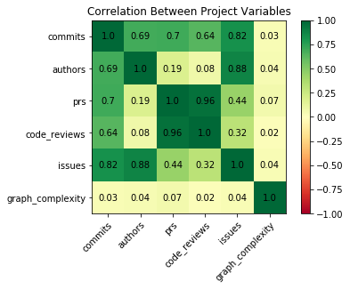
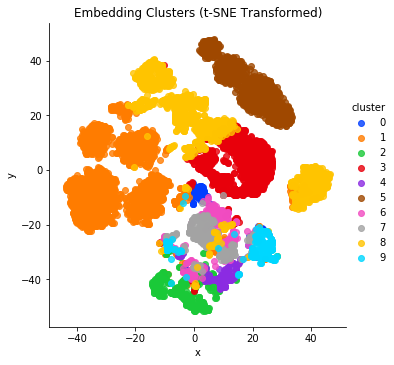
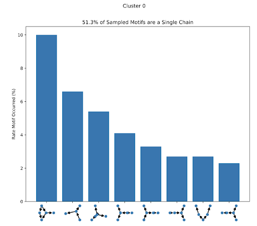

## About the Project
This project aims to understand how people are currently using Git, with the eventual goal of creating recommendations for an easier-to-use alternative. In particular, we are pulling out the most common Git subgraphs to better understand Git usage. For more about the motivation behind the project, see Greg’s post here: http://third-bit.com/2017/09/30/git-graphs-and-engineering.html and our blog post introducing the project here: https://ubc-mds.github.io/RStudio-GitHub-Analysis/2019/05/10/project-introduction.html. 

## Initial Analysis
<u>Collecting Data</u>  
We’ve been collecting data for our analysis from GitHub Torrent (http://ghtorrent.org/), a wonderful project that logs public activity in GitHub and makes it publicly available as a monthly database dump. One big limitation of this dataset is that it doesn’t include users’ local commands (such as adding a file to be staged, switching branches, etc.), which means we only have access to a fragment of users’ actual Git workflow. For a more detailed walkthrough of our data collection process, see our blog post here: https://ubc-mds.github.io/RStudio-GitHub-Analysis/2019/05/03/up-and-running.html.

<u>Initial Analysis - Understanding the GitHub Torrent Dataset</u>  
We started by getting a high-level overview on the dataset we’re working with.

Of the 36.4 million projects that GitHub Torrent has information on...

- 19.03 million projects, or 52.29%, have more than one commit.
- 5.19 million project, or 14.27%, have more than one author contributing commits.

Presumably many of these single-commit repos are people using GitHub as file storage, or starting a project and then abandoning it; while these are obviously legitimate uses of GitHub, they are not interesting for our purposes. Therefore, we’ve only included repositories with multiple commits and multiple authors in our analysis. 

Even for these ‘interesting’ projects with multiple commits and authors, we see relatively low engagement with common GitHub features like issues and pull requests. Of these 5.19 million projects...

- 1.31 million, or 25.15% have at least one issue 
- 1.05 million, or 20.21%, have at least one pull request
- 568 thousand, or 10.94%, have at least one discussion comment on a pull request (general comment or code review)
- 208 thousand, or 4.02%, have at least one code review

For every Git repo, the commits form a directed acyclic graph. A more complex graph pattern correspond with more frequent branches and merges in the repo. We are currently using a proxy for graph complexity where we take many random samples of connected nodes in a project’s graph and see what percentage of the time these connected nodes form a pattern that is not just a single chain (and instead exhibits some branching and merging behavior). 

Below we’ve taken a random sample of 10,000 GitHub projects and looked at the correlation between their number of commits, number of authors, number of pull requests, etc. and this measure of graph complexity.

As you can see, commits, authors, pull requests, code reviews, and issues are all positively correlated with one another, which makes intuitive sense. We do see a positive correlation between graph complexity and these other variables, but it is extremely small. This seems odd to us: wouldn’t, for example, a project with many authors be more likely to have more branches than a project with only a few authors? Perhaps we’re not analyzing the data on the proper level. There might be multiple different workflows that lead to more or less complex graph structures paired with more or less GitHub activity, but these patterns are not apparent at this level of analysis.

In order to generate more specific and actionable suggestions on how people can best use Git, we need to get a more nuanced picture of how different kinds of Git projects work, which leads us to what we’re working on now.

## What We’re Working on Now
Firstly, we are clustering together similar projects based on their underlying graph structure. Then, for each of these clusters, we are picking out the features we’ve mentioned above (number of issues per project, number of code reviews per project, etc.), plus each cluster’s most commonly-occuring subgraphs, the average expertise of the projects' contributors, and what programming languages are being used. We’ll use these observations to build a more complete picture of how people are using Git.

<u>Clustering Similar Projects</u>  
We decided to group repositories with similar Git graph structures together so that 1) we can find groups of repositories that are very simplistic and discard them from further analysis and 2) we can seperate out the different Git strategies that people employ.
We clustered projects based on their graph structure by using Graph2Vec (a “neural embedding framework” for graphs based on Doc2Vec: https://arxiv.org/abs/1707.05005) to get embeddings for each project, and then clustering on those embeddings. Below is the results of an early attempt at making these clusters.

Every dot represents a GitHub project, and every unique color represents a different cluster. The closer two dots are to each other, the more similar their graph structure is. For example, projects in clusters 1, 5, and 8, all of which appear near the top half of the graph, are the projects with mostly single chains of commits (i.e. projects with little or no branching and merging).

<u>Most Common Subgraphs</u>  
Once we have these clusters, we can pick out their most commonly-occuring subgraph patterns. Below is an example of the most common subgraphs from a particular cluster (we refer to common subgraphs as `motifs`).

There are many ways we can use these patterns to build up an understanding of how people are using Git. For example, one metric we’ve already mentioned is the percentage of subgraphs that aren't just a single chain of commits, which is useful for understanding a project’s relative complexity.

<u>Cluster Indices</u>  
We are also creating indices for each cluster that speak to the expertise (e.g. average contributor’s time on GitHub), activity (e.g. average commits pushed per week), and author diversity (e.g. number of contributing authors) of the projects within that cluster. This will help us develop project personas for each cluster. We can then connect each cluster’s persona with it's subgraph patterns in order to make recommendations. For example, if we’re able to understand which projects are made by Git beginners, we can infer what is and isn’t working for them. We are also starting to look at other information about the projects (e.g. what programming languages are used most frequently) and layering that onto our analysis. 

## Next Steps
<u>What We’re Working on Next</u>  

- Look at the graph patterns that come from successful projects by well-known authors and see how their patterns are (or are not) different than other, less successful projects. 
- Find repos that use workflows like Gitflow (https://www.atlassian.com/git/tutorials/comparing-workflows/gitflow-workflow) and see whether or not they are fundamentally different from repos that don’t use a standardized workflow (sidenote: if you have any ideas on how to identify if a project is using Gitflow, or how to identify if a branch is a certain kind of branch within the Gitflow framework, we’d love to hear from you!).
- For each project, identify how many branches are able to be merged back into a master branch and how many branches have a conflict preventing it from being merged back. Use these numbers as a proxy for how much success people are having using Git within that project (if you have an idea on how to tell whether or not a branch is ‘mergable’ back to master, please let us know!).

<u>Future Project Extensions</u>  

- Look at each project’s source code to better classify and understand different projects.
- Survey Git users directly and get their feedback on what issues they have with the tool.
- Collect and analyze data on peoples’ local Git activity.

## Call for Suggestions
Have an idea of other things we should try out to better understand how people use Git? Please don’t hesitate to contact us! And stay tuned for more updates on our progress as the summer progresses!

