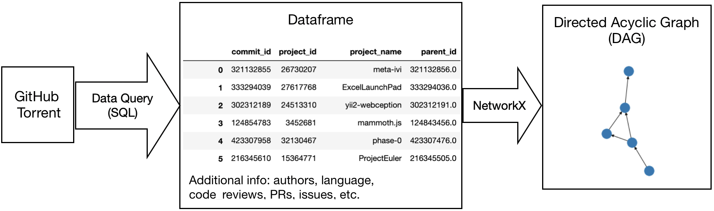

```{r setup, include=FALSE}
options(htmltools.dir.version = FALSE)
#library(xaringanthemer)
#mono_accent(base_color = "#75aadb")
```
class: inverse

.center[
### RStudio Github Analysis: What the Git is going on here?
Juno Chen, Ian Flores, Rayce Rossum, Richie Zitomer<br>Mentor: Dr. Tiffany Timbers<br>Partner: Dr. Greg Wilson from RStudio
]

.pull-left[
#### Goal

Partner's Goal: Build a tool to support most common Git workflows

Our Goal: Find the most common Git workflows, provide recommendation to building the tool
]


.pull-right[

#### Questions we aim to answer

1, Are there identifiable workflow patterns in the way people use git?

2, What are common subgraphs that account for a large fraction of everyday use?

]

.center[
#### Data
]


---
class: inverse

.center[
#### Key Findings
]

- Overwhelming number of projects consist of a single commit and/or author. Out of 36.4 million projects...

|            | > 1 Commit    | > 1 Author   |
|------------|---------------|--------------|
| # Projects | 19.03 million | 5.19 million |
| % Total    | 52.29%        | 14.27%       |


- Many branches that are created aren't merged back in within the next 5 or 25 commits.

- 84.3% of motifs length 5 and 56.1% of motifs length 25 are a single chain (no branching or merging).

- A project's graph complexity is related to it's usage of GitHub features