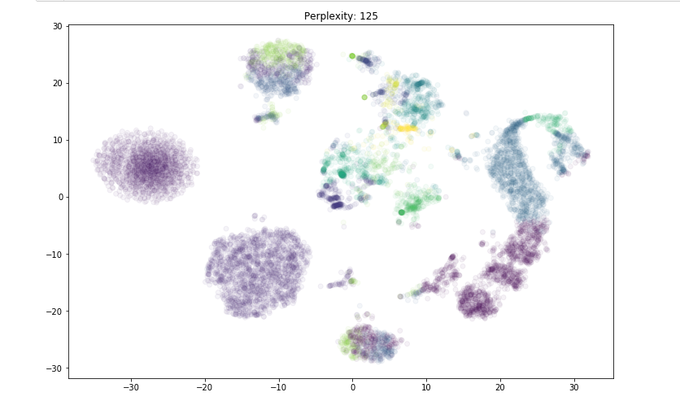
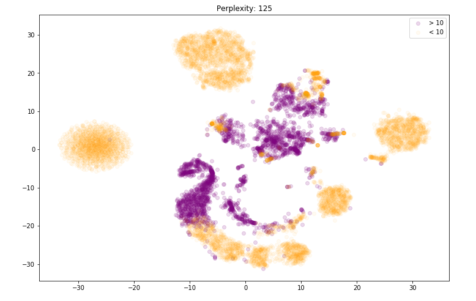
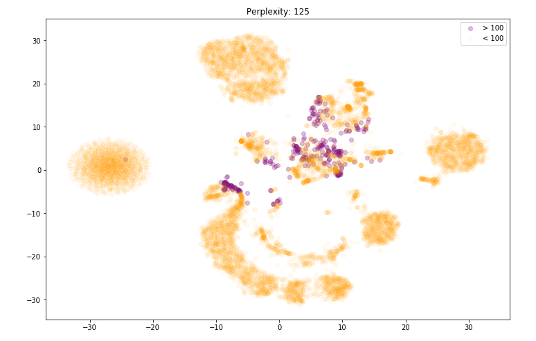
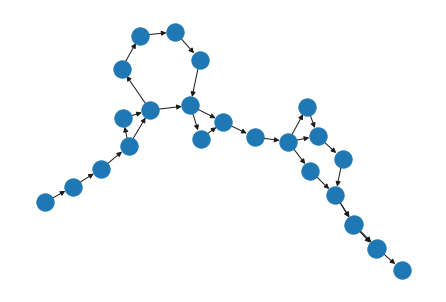
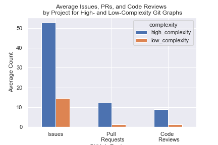

```{r setup, include=FALSE}
options(htmltools.dir.version = FALSE)
library(xaringanthemer)
```

background-image: url("http://avante.biz/wp-content/uploads/2017/04/Computer-Science-Wallpapers-001.jpg")
class: inverse, center, middle

# Overview

---
## Background - Git

.pull-left[
The most widely used modern version control system in the world

Designed with **performance**, **security** and **flexibility** in mind...
]

---
## Background - Git

.pull-left[
The most widely used modern version control system in the world

Designed with **performance**, **security** and **flexibility** in mind...

but not **ease of use**.
]

.pull-right[

]

---
## Our Partner

Picture of Greg and RStudio logo

---
## Our Partner's Idea

- Download data from several thousand large projects on GitHub.

--

- Use your favorite statistical (machine learning) techniques to identify patterns in those repositories’ branch-and-merge graphs.

--

- Select a small set of common subgraphs that account for a large fraction of everyday use.

--

- Build a tool that provides those, and only those, to users. 

--

- **Profit.** Well, fame. OK, will you settle for having made the world a better place?

.footnote[
Source: [third-bit.com - Greg's Blog](http://third-bit.com/2017/09/30/git-graphs-and-engineering.html)
]

---

## Our Role

---

## Our Data

---

class: inverse, center, middle
background-image: url("http://avante.biz/wp-content/uploads/2017/04/Computer-Science-Wallpapers-001.jpg")

# Questions

---
class: inverse, center

<br><br><br><br>

## Question 1

### Are there identifiable workflow patterns in the way people use git?

--

## Question 2

### What are common subgraphs that account for a large fraction of everyday use?

---
## How we'll answer question 1

q1 - Clustering

---
## Challenges

Working with this kind of data is new and difficult

We need to convert this data to a vector for q1

---

## Graph2Vec Overview

For q1

Collection of Text -> Doc2Vec -> Vectors

Collection of Graphs -> Graph2Vec -> Vectors

---
## Are there identifiable workflow patterns in the way people use git?

Using Graph2Vec to generate embeddings, we used T-SNE to reduce the dimensionality and look for visible clusters in our data.

--

Refer backwards to the data overview, some are not "interesting".

--

Image (cluster comparison, heatmap?)

--

Are there identifiable workflow patterns in the way people use git?

--

Yes

--

Are they useful? Not really, they're mostly just git init's...

- image for Commit density plot
- image for Author density plot

Of the 36.4 million projects that GitHub Torrent has information on...
- 19.03 million projects, or 52.29%, have more than one commit.
- 5.19 million project, or 14.27%, have more than one author contributing commits.

---
## Clustered Projects with Similar Graph Types 



---
## Projects with Similar Numbers of Commits are Clustered Together



---
## Projects with Similar Numbers of Commits are Clustered Together



---
# Blob slide (zoomed in 100+)

---
HEATMAP, etc.
As a result, we are only looking at projects with more than 100 commits.

---
# How we'll answer question 2

q2 - What a motif is, how motifs help us

For q2

- Motif: subgraphs within network, defined by a particular pattern of interactions between vertices.

--

- Finding motifs involves pick a random node, then performing a breadth-first search on the first k nodes after that.

--

- Below is an example of a length-25 motif generated from a GitHub project.



---
# Challenges

The length of motifs and identifying equivalent patterns of different lengths

Motif length EDA

---
# Motif Exploration

---
## What are common subgraphs that account for a large fraction of everyday use?

- Motif overview for all projects
- Snippets from the report (motif freq for interesting clusters)
- Interesting stuff we found
- Note: High Complexity = More Branching and Merging
- As you can see below, GitHub projects with more complex graphs have more issues, pull requests, and code reviews than projects with simpler graphs.



---
## Limitations to answering both questions

- Squashing
- Public (Only things that make it to github)
- GHTorrent data cleanliness and availability

---
## Wrap-up

These were our questions
Here's what we did
Here are our recommendations

---

class: inverse, center, middle
background-image: url("http://avante.biz/wp-content/uploads/2017/04/Computer-Science-Wallpapers-001.jpg")

# Recommendations 
---

## Confident Recommendations
- Study the causal relationship between GitHub feature usage and graph complexity
- Given the relationship between complexity and GitHub feature usage, a new tool should direct users to use the documentation features such as issues and PR reviews to maintain a long term structure.
- We can see a consistent percentage of language use in big projects between the largest 8 languages in our sample. This is indicative that a new tool should be language agnostic as users tend to follow patterns not guided by languages.
- We couldn’t find evidence of the use of Git Flow or other types of pre-established workflows. This doesn’t mean the patterns don’t exist, but they might not be as prevalent as thought before. A new tool should either give the option to users to strictly be forced to follow one of these pre-established workflows, or don’t consider them altogether.
- Most repositories have less than 50 authors, thus indicating that a new tool should maximize for the effectiviness of collaboration in small and medium projects and not for big projects.This is because tools like Git were created to optimize collaboration for projects  like the Linux Kernel, but the vast majority of projects are way smaller than the Kernel.
- Work backwards from very successful and large projects
- Take into account the time between commits
- Label graph nodes by author within motifs
- Exclude motifs at beginning and end of graph
- Find repos that claim to use Gitflow and see whether or not they’re fundementally different

---
## Tentative Recommendations 

---
## Requires further exploration

---
## Next Steps

---
class: inverse, center, middle
background-image: url("http://avante.biz/wp-content/uploads/2017/04/Computer-Science-Wallpapers-001.jpg")

# Acknowledgments

RStudio - Greg Wilson
    
UBC-MDS Teaching Team - Tiffany Timbers

---
class: inverse, center, middle
background-image: url("http://avante.biz/wp-content/uploads/2017/04/Computer-Science-Wallpapers-001.jpg")

# Questions?
---
