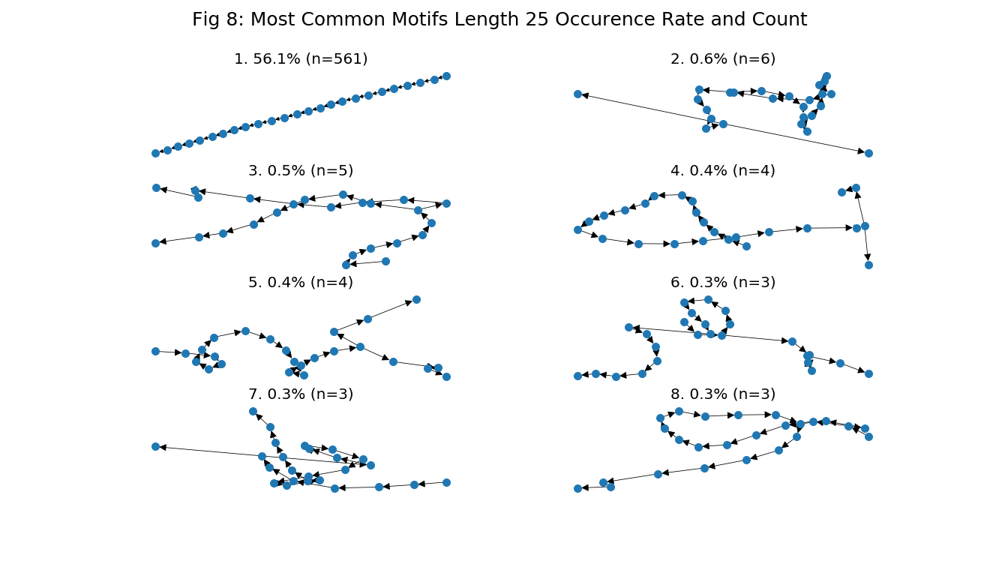
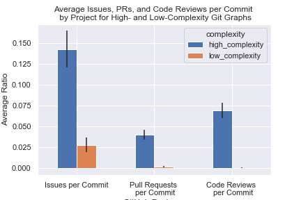

```{r setup, include=FALSE}
options(htmltools.dir.version = FALSE)
library(xaringanthemer)
mono_accent(base_color = "#75aadb")
```

class: inverse, center, middle

## Our Partner

.pull-left[
### R Studio

]


.pull-right[
### Dr. Greg Wilson

]

---
background-image: url("http://avante.biz/wp-content/uploads/2017/04/Computer-Science-Wallpapers-001.jpg")
class: inverse, center, middle

# Overview

---
## Background - Git

.pull-left[
The most widely used modern version control system in the world

Designed with **performance**, **security** and **flexibility** in mind...
]

---
## Background - Git

.pull-left[
The most widely used modern version control system in the world

Designed with **performance**, **security** and **flexibility** in mind...

but not **ease of use**.
]

.pull-right[

]

---
## Our Partner's Idea

- Get data for a large number of projects from GitHub.

--

- Identify branching and merging patterns using any statistical or machine learning approach on the commit history of the graphs

--

- Select a small set of common subgraphs that account for a large fraction of everyday use

--

- Build a tool to support those most common subgraphs

--

- **Profit.** Well, fame. OK, will you settle for having made the world a better place?

.footnote[
Source: [third-bit.com - Greg's Blog](http://third-bit.com/2017/09/30/git-graphs-and-engineering.html)
]

---

## Our Role

To build the tool, we need to understand how people use Git
- What works for workflows
- What is hindering workflows
- **What are those workflows?**
    
We only have **data** to answer one of these questions
- Access to commit history
- This enables us to draw up recommendations for the new tool that RStudio is interested in developing.  

---

## Our Data


---

class: inverse, center, middle
background-image: url("http://avante.biz/wp-content/uploads/2017/04/Computer-Science-Wallpapers-001.jpg")

# Questions

---
class: inverse, center

<br><br><br><br>

## Question 1

### Are there identifiable workflow patterns in the way people use git?

--

## Question 2

### What are common subgraphs that account for a large fraction of everyday use?

---
## Approach to Identifying Workflow Patterns

- Unsupervised Learning

--

- Natural Language Processing

--


---
## Challenges

- Working with graph data is new (the algorithm we're using was published in **late 2018**)

--

- We need to convert this data to something we can work with and cluster

--

- Natural Language Processing also has this problem

---

## Graph2Vec Overview


---
## Are there identifiable workflow patterns?


---
## Language Distributions by Clusters


---
## Greater than 10 commits


---
## Greater than 100 commits


---

## Are there identifiable workflow patterns?

--

**Yes**

--

Are they useful?

--

**Not really**, they're mostly just git init's...

--

Out of 36.4 million projects

|            | > 1 Commit    | > 1 Author   |
|------------|---------------|--------------|
| # Projects | 19.03 million | 5.19 million |
| % Total    | 52.29%        | 14.27%       |

--

Moving forward, we'll be looking at projects with **> 100 commits**

So why don't we only cluster on large projects?

---
## Clustering on 100+ commits

.pull-left[
- Due to the **variability** in large projects, our approach is unable to find clear clusters.

- This doesn't mean we can't do anything with this result, it just requires a deeper analysis and future work.
]

.pull-right[

]

---
## Approach to Identifying Common Subgraphs

- Question 2: What are common subgraphs that account for a large fraction of everyday Git use?

--

<div style="text-align: left">
- Looked the most common motifs in Git projects with 100+ commits.
 - Motifs: Subgraphs that appear in a network at a much higher frequency than random chance.

--

<div style="text-align: center">

---
## Challenges

<div style="text-align: left">
- It's challenging to associate similar (but not identical) motifs together.
    - Leads to a lot of noise in the data.
- For example, you can see that the motifs below are all similar to one another.
 - No easy way to associate them algorthmically.
 - Challenging to do visually for longer motifs. 
 
<div style="text-align: center">

--
<div style="text-align: left">
- Shorter motifs generated from Git graphs consists of mostly single chains (no branching or merging)

---
## Choosing Motif Length to Analyze

- Given these challenges, what motif length should we study?
 - Looked at what percentage of projects in our dataset had motifs with at least one branch or merge for different motif lengths.
 
<div style="text-align: center">

--

<div style="text-align: left">
- Answer: Study motif lengths 25 and 5.
 - Motifs length 25 are the shortest chain lengths that aren't overwhelmed by single chains.
 - Motif length 5, despite consisting of mostly single chains, are useful for seeing small patterns visually.
 
---
## Most Common Git Motifs

<div style="text-align: center">

---
## Most Common Git Motifs

<div style="text-align: center">

---

## Key Findings

- Many branches that are created aren't merged back in within the next 5 or 25 commits.

 - 42% of motifs length 5 and 13% of motifs length 25 that start with a branch don't contain a single merge.

 - There is 1.41x more branches than merges in the dataset overall.


--

<br />  

- 84.3% of motifs length 5 and 56.1% of motifs length 25 are a single chain (no branching or merging). 

 - Many large projects consist of mostly single chains. Are these projects fundamentally different than projects with branching and merging?

---

## Secondary Finding: A Project's Graph Complexity is Related to it's Usage of GitHub Features

<div style="text-align: center">

<div style="text-align: left">
- GitHub projects with more complex graphs have more issues, pull requests, and code reviews than projects with simpler graphs.

---
## Limitations to answering both questions

- Squashing and Rebasing
- Public activity only
- GHTorrent data cleanliness and availability

---
## Summary


- Our questions were aimed to understand:
  - Identifiable workflow patterns in the way people use git
  - Common subgraphs that account for a large fraction of everyday use
  
- To do this we:
  - Performed clustering using Graph2Vec and K Means
  - Extracted motifs from the different projects

- Based on the insights extracted from the data we then divided our recommendations in three categories:
  - Confident
  - Tentative
  - Requires further exploration

---

class: inverse, center, middle
background-image: url("http://avante.biz/wp-content/uploads/2017/04/Computer-Science-Wallpapers-001.jpg")

# Recommendations 
---

## Confident Recommendations

- We see consistent language use in big projects between the largest 8 languages in our sample.
  - A new tool should be language agnostic as users tend to follow patterns not guided by languages.

- Many large projects are mainly single chains
  - A new tool should incorporate a centralized workflow with a branch from which the other branches derivate. (master branch)
  
---
## Tentative Recommendations 

- There is a positive correlation between complexity and GitHub feature usage
  - A new tool should direct users to use the documentation features such as issues and PR reviews to maintain a long term structure.

- Branching is 1.41x more prevalent than merging
  - A new tool should consider a mechanism to force users to keep up to date within a certain number of commits.
  
---
## Requires further exploration

- Couldn’t find evidence of the use of Git Flow or other types of pre-established workflows. 
  - An approach looking specifically for this patterns needs to be considered in order to determine if they are prevalent or not.

- Look at the relationship between the number of people contributing to a repository and the complexity that the project takes in the long run.

---
## Next Steps

- Study the causal relationship between GitHub feature usage and graph complexity
- Trace successful and large projects in the embeddings space
- Weight graphs with the time between commits
- Add graph node attributes such as authors within motifs
- Exclude motifs at beginning and end of graph
- Find repos that claim to use pre-established workflows

---
class: inverse, center, middle
background-image: url("http://avante.biz/wp-content/uploads/2017/04/Computer-Science-Wallpapers-001.jpg")

# Acknowledgments

RStudio - Dr. Greg Wilson & Dr. Reid Holmes
    
UBC-MDS Teaching Team - Dr. Tiffany Timbers
 
All the Capstone Teams

---
class: inverse, center, middle
background-image: url("http://avante.biz/wp-content/uploads/2017/04/Computer-Science-Wallpapers-001.jpg")

.pull-left[
<br><br><br><br><br><br>
# Questions?
]

.pull-right[

]