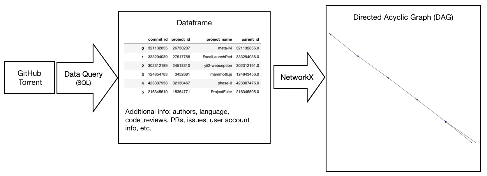
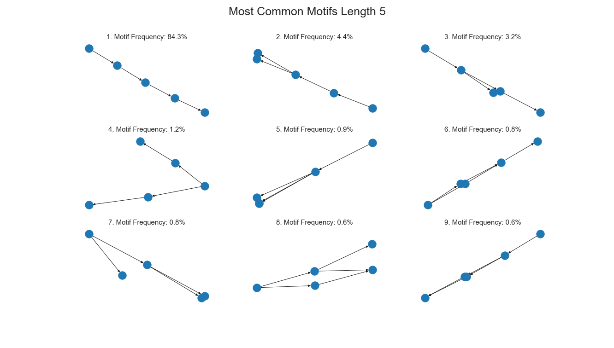
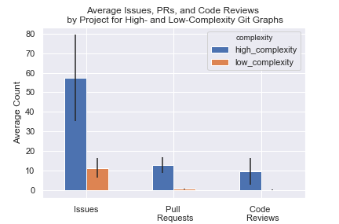

```{r setup, include=FALSE}
options(htmltools.dir.version = FALSE)
library(xaringanthemer)
```

background-image: url("http://avante.biz/wp-content/uploads/2017/04/Computer-Science-Wallpapers-001.jpg")
class: inverse, center, middle

# Overview

---
## Background - Git

.pull-left[
The most widely used modern version control system in the world

Designed with **performance**, **security** and **flexibility** in mind...
]

---
## Background - Git

.pull-left[
The most widely used modern version control system in the world

Designed with **performance**, **security** and **flexibility** in mind...

but not **ease of use**.
]

.pull-right[

]

---
## Our Partner

.pull-left[
### R Studio

]


.pull-right[
### Dr. Greg Wilson

]


---
## Our Partner's Idea

- Get data for a large number of projects from GitHub.

--

- Identify branching and merging patterns using any statistical or machine learning approach on the commit history of the graphs

--

- Select a small set of common subgraphs that account for a large fraction of everyday use.

--

- Build a tool that provides the common subgraphs that account for the most common patterns.


.footnote[
Source: [third-bit.com - Greg's Blog](http://third-bit.com/2017/09/30/git-graphs-and-engineering.html)
]

---

## Our Role

To build the tool, we need to understand how people use Git
- What works for workflows
- What is hindering workflows
- **What are those workflows?**
    
We only have **data** to answer one of these questions
- Access to commit history
- This enables us to draw up recommendations for the new tool that RStudio is interested in developing.  

---

## Our Data



---

class: inverse, center, middle
background-image: url("http://avante.biz/wp-content/uploads/2017/04/Computer-Science-Wallpapers-001.jpg")

# Questions

---
class: inverse, center

<br><br><br><br>

## Question 1

### Are there identifiable workflow patterns in the way people use git?

--

## Question 2

### What are common subgraphs that account for a large fraction of everyday use?

---
## How we'll answer question 1

q1 - Clustering

---
## Challenges

Working with this kind of data is new and difficult

We need to convert this data to a vector for q1

---

## Graph2Vec Overview

For q1

Collection of Text -> Doc2Vec -> Vectors

Collection of Graphs -> Graph2Vec -> Vectors

---
## Are there identifiable workflow patterns in the way people use git?

Using Graph2Vec to generate embeddings, we used T-SNE to reduce the dimensionality and look for visible clusters in our data.

--

Refer backwards to the data overview, some are not "interesting".

--

Image (cluster comparison, heatmap?)

--

Are there identifiable workflow patterns in the way people use git?

--

Yes

--

Are they useful? Not really, they're mostly just git init's...

- image for Commit density plot
- image for Author density plot

Of the 36.4 million projects that GitHub Torrent has information on...
- 19.03 million projects, or 52.29%, have more than one commit.
- 5.19 million project, or 14.27%, have more than one author contributing commits.

---
## Clustered Projects with Similar Graph Types 


---
## Size is represented in the embeddings as a feature


---
## Size is represented in the embeddings as a feature


---
# Blob slide (zoomed in 100+)

---
HEATMAP, etc.
As a result, we are only looking at projects with more than 100 commits.

---
## How We'll Answer Question 2 - Overview

- Question 2: What are common subgraphs that account for a large fraction of everyday use?

--

- Motif: subgraphs within a network that appear at a much higher frequency than random chance.

--

<div style="text-align: left">
- Our procedure for finding motif involves sampling a random node in the graph, then performing a breadth-first search on the first k nodes after that and repeating many times to build up a dataset.

--

<div style="text-align: center">

---
## How We'll Answer Question 2 - Challenges

- It's challenging to associate similar (but not identical) motifs together.

<div style="text-align: center">

--

<div style="text-align: left">
- Shorter motifs generated from Git graphs are mostly single chains; longer motifs are hard to interpret.

---
## Choosing Motif Length to Analyze

- Given these challenges, what motif length should we study?

<div style="text-align: center">

--

<div style="text-align: left">
- Answer: Study motif lengths 5 and 25.
 - Motif length 5 are useful for seeing the smaller patterns visually.
 - Motifs length 25 are the shortest chain length that aren't overwhelmed by single chains.
 
---
## Most Common Git Motifs

<div style="text-align: center">

---
## Most Common Git Motifs

<div style="text-align: center">

---

## Key Findings:

- As you can see, many branches that are created aren't merged back in within the next 5 or 25 commits.

 - 42% of motifs length 5 that start with a branch don't contain a single merge. 13% of motifs length 25 that start with a branch don't contain a single merge.

 - There is 1.41x more branches than merges in the dataset overall.


--

<br />  

- 84.3% of motifs length 5 and 56.1% of motifs length 25 are a single chain (no branching and merging). 

 - Based on this data, many large projects consist of mostly single chains. 

 - Are these projects fundementally different than projects with branching and merging?

---

## How a Project's Graph Complexity is Related to it's Usage of GitHub Features

<div style="text-align: center">

<div style="text-align: left">
- GitHub projects with more complex graphs have more issues, pull requests, and code reviews than projects with simpler graphs.

---
## Limitations to answering both questions

- Squashing
- Public (Only things that make it to github)
- GHTorrent data cleanliness and availability

---
## Summary


- Our questions were aimed to understand:
  - Identifiable workflow patterns in the way people use git
  - Common subgraphs that account for a large fraction of everyday use
  
- To do this we:
  - Performed clustering using Graph2Vec and K Means
  - Extracted motifs from the different projects

- Based on the insights extracted from the data we then divided our recommendations in three categories:
  - Confident
  - Tentative
  - Requires further exploration

---

class: inverse, center, middle
background-image: url("http://avante.biz/wp-content/uploads/2017/04/Computer-Science-Wallpapers-001.jpg")

# Recommendations 
---

## Confident Recommendations
- We can see a consistent percentage of language use in big projects between the largest 8 languages in our sample.
  - A new tool should be language agnostic as users tend to follow patterns not guided by languages.

---
## Tentative Recommendations 

- There is a positive correlation between complexity and GitHub feature usage
  - A new tool should direct users to use the documentation features such as issues and PR reviews to maintain a long term structure.

- Branching is 1.41x more prevalent than merging
  - A new tool should consider a mechanism to force users to keep up to date within a certain number of commits.
  
---
## Requires further exploration

- Couldn’t find evidence of the use of Git Flow or other types of pre-established workflows. 
  - An approach looking specifically for this patterns needs to be considered in order to determine if they are prevalent or not.

- Look at the relationship between the number of people contributing to a repository and the complexity that the project takes in the long run.

---
## Next Steps

- Study the causal relationship between GitHub feature usage and graph complexity
- Trace successful and large projects in the embeddings space
- Weight graphs with the time between commits
- Add graph node attributes such as authors within motifs
- Exclude motifs at beginning and end of graph
- Find repos that claim to use pre-established workflows

---
class: inverse, center, middle
background-image: url("http://avante.biz/wp-content/uploads/2017/04/Computer-Science-Wallpapers-001.jpg")

# Acknowledgments

* RStudio - Greg Wilson
    
* UBC-MDS Teaching Team - Tiffany Timbers
 
* All the other Capstones Teams

---
class: inverse, center, middle
background-image: url("http://avante.biz/wp-content/uploads/2017/04/Computer-Science-Wallpapers-001.jpg")

# Questions?
---
