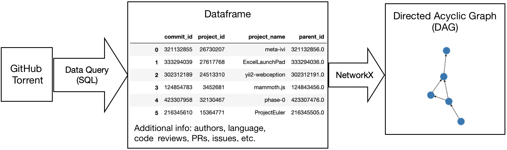
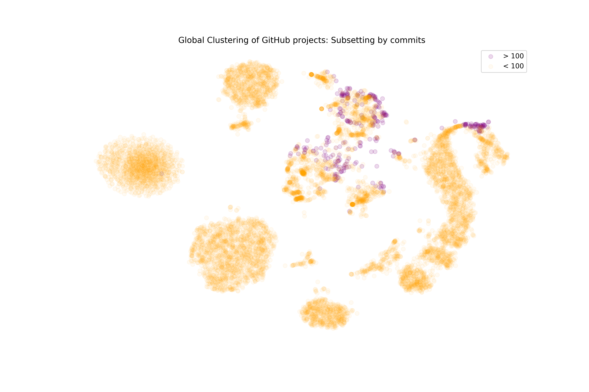
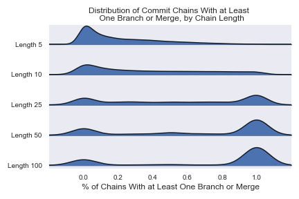
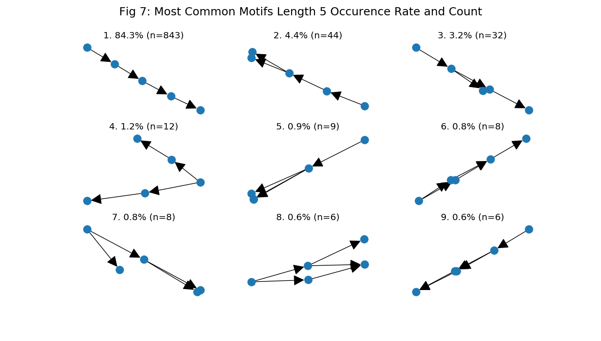
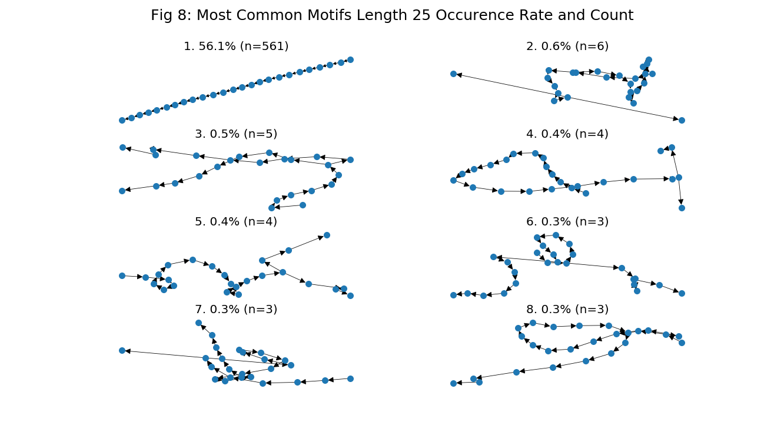
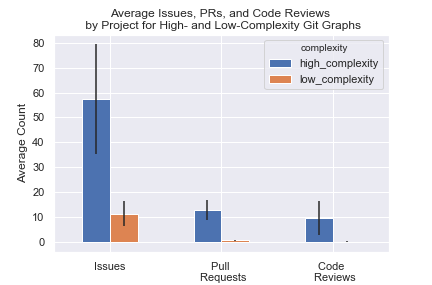

```{r setup, include=FALSE}
knitr::opts_chunk$set(echo = TRUE)
```

# Executive Summary

Our project aims to identify common Git workflows, with the end goal of using our understanding of these workflows to provide recommendations for features that should or should not be included in an easy-to-use Git alternative. For this study we had the hypothesis that there are common Git workflows that account for a large fraction of everyday use. To test this hypothesis, we used an Unsupervised Learning technique inspired by Natural Language Processing. The analysis results proved the existence of common patterns in Git workflows.

# Introduction

Git is a version control system used to record how files change over time^[1]^. Many people use Git for tracking individual work and as a tool for collaboration. However, users ranging from novices to experts have argued that the tool is not user friendly and needs to be improved. 

RStudio is interested in developing a new tool for Git users that improves and consolidates common Git workflows. Our partner, Dr. Greg Wilson from RStudio, suggested that to understand what should be included in the alternative tool, data analysis should be performed first on what is currently being done by Git users. This is where our project comes in.

Our data was sourced from GitHub Torrent, which mines the GitHub API to track all public GitHub repositories and makes it available as a database. From this database we created a data set of where the observational unit was a GitHub repository. To do this we retrieved the commit history for 10,000 GitHub repositories and for each repository we used the Python NetworkX^[2]^ package to transform the data into a Directed Acyclic Graph (DAG), where:

- Each graph represents one repository;
- Each node in the graph is one commit;
- Each directed edge in the graph is connection from one commit to the other (chronological order).

We also queried other data tables from GitHub Torrent for important features such as authors, programming language, code reviews, et cetera, to support exploratory data analysis.



*Fig 1: Data Transformation*	

With this project, we aim to answer two fundamental questions that can enable the development of the new tool:

1. The first question we aimed to answer was **"are there identifiable workflow patterns in the way people use Git?"**. We anticipated that answering this question would enable us to understand how different workflows are used in different contexts. To answer this question, we worked to identify distinct subgroups within our sample of GitHub repositories when considering the complete graphs of each repository.

2. The second question we aimed to answer was **"what are common subgraphs that account for a large fraction of everyday use?"**. With this question we wanted to see if we could confirm the hypotheses that distinct subgroups of users follow workflows such as the Gitflow or if they follow other common workflows that are more intuitive for them. To answer this question, we extract subgraphs of defined lengths and studied whether certain sub-patterns appear to be distinct and common among users.

Answering these questions has provided some insights that may inform the development of a new tool that improves and consolidates workflows for users of Version Control Systems, as well as led us to specific recommendations on which additional studies should be done to better understand how people use Git.

# Data Science Methods

## Are there identifiable workflow patterns in the way people use git?

### Unsupervised Learning

Unsupervised learning is a realm of data science methods used to find previously unknown patterns in a data set without explicit labels. By learning features from the data, these types of algorithms allows us to group similar data points together based on similarity. By grouping similar git commit graph's together, we hope to identify common workflow patterns.


The most common and widely used unsupervised learning methods require a matrix of numeric values, therefore we must first convert our graph data into a more appropriate format. In the same way documents are built up of sentences and words, graphs are made up of subgraphs and nodes. Knowing this, we took inspiration from Natural Language Processing’s (NLP) concept of word embeddings. After some research, we settled on a Doc2Vec based algorithm called Graph2Vec^[4]^. In the same way that Doc2Vec can take a collection of documents and generate a vector of word embeddings, Graph2Vec can take a collection of graphs and generate a vector of graph embeddings. The generation of this embeddings means that we transform our graphs into a matrix of numeric values - a more useful format for the unsupervised learning methods we intended to use.


### Cluster Analysis

After generating embeddings for each commit graph in our sample, we used K-Means clustering which is an Unsupervised Learning method that works by repeatedly calculating the average distance of all points in a cluster, choosing that point as the center of the cluster and then recalculating the clusters.

We used the gap statistic to choose an optimal number of clusters (Supplemental Table 1). We ultimately settled on 19. The results of this clustering is shown below in a dimensionality reduced T-SNE plot. 


*Fig 2: T-SNE of Global Clusters*	

The above shows very clear clusters indicating that there are clear groups and differences between the structure of different graphs. In order to identify what makes our clusters different, we needed to do some exploration. Firstly, we plotted the predominant languages for each cluster.


*Fig 3: Radial Language Plots of Global Clusters*

We hypothesized that different types of git users such as Software Developers and Data Scientists would have fundamentally different usage patterns. However, the fairly homogenous spread of programming languages across the clusters indicates that this not the case. At this point we took a step back and examined the number of commits within our sampled projects. 




*Fig 4: Number of Commits of Global Clusters*

Looking at the above figure, we can see that only a very small portion of projects have > 100 commits. We also notice that large projects tend to fall within the top right corner of the T-SNE embedding space. WHAT DOES THAT MEAN? EXPLAIN HERE. ALSO, ARE THEY ALL IN ONE CLUSTER (AS DEFINED BY KMEANS) OR ACROSS A FEW (AND IF SO, WHICH FEW)? 

### Clustering of > 100 commits

Using the insights from our analysis that the majority of projects had less than 100 commits, we decided to focus our efforts on larger projects. We chose to do this based on the assumption that larger projects will better define Clustering again on projects with more than 100 commits results in the following clustering process represented in the T-SNE plot  below.


*Fig 5: Clustering of Projects > 100 Commits*

The above plot does not show clear cluster boundaries in projects with greater than 100 commits. This is indicative of an absence of distinct subgroups of ~~high variability~~ workflows within large projects. COMMENT ON WHETHER THIS IS DUE TO ONE LARGE SPREADOUT CLUSTER OR ONE TIGHT NARROW CLUSTER (*Total within sum of square and between sum of squares should answer this*).  A possible interpretation of this result is that every workflow is represented (and represented with roughly equal frequency) and that there are no identifiable distinct sub-types of workflows in large projects that could be indentified using our current method. This leads us to conclude in this question that there are identifiable workflow patterns although they are not that useful (NOT USEFUL FOR WHAT?). At the global level we can see that the majority of projects fall into short, single chain projects (WHERE IS THE DATA DEMONSTRATING THESE ARE SINGLE CHAINS?). This tells us that the main workflow on Github is to just commit to master and work alone. This is backed up by the fact that out of 36.4 million projects we sampled, 48% have only a single commit, and 85% have only a single author. For the rest of our analysis, we just looked at projects with >100 commits and considered them one homogenous group.

## What are common subgraphs that account for a large fraction of everyday use?

We leveraged the concept of motifs from network theory in order to surface the most common subgraphs that account for a large fraction of everyday Git use. Motifs are subgraphs that appear in a network at a much higher frequency than random chance^[5]^. We found the most frequent motifs and their relative occurrences using the method described below.

### Generating Motifs

For generating a motif of length k, we took the following steps.

- First, we turned all commits within a random sample of projects with greater than 100 commits into a network graph.
- Then, in order to generate motifs, we chose a random node (commit) in the network, then walked k steps forward^[6]^ using breadth-first search. 
- We then repeated this process one thousand times to generate a sample dataset of motifs.
- Finally, we associated all graphs that were isomorphic to one another and counted the frequency of each type of graph.

Generating motifs at the project level was a little more challenging, for two reasons: firstly, it was prohibitively time-consuming to generate one thousand samples from each project for all projects in our sample, and, secondly, we were concerned that randomly sampling the motifs at a project level would lead to the same parts of the graph being sampled over and over again. So we made a slight modification to the motif-generating process above and, instead of choosing a random node to start with for each sample, we started at the root node(s) in the graph and then took k steps forward using breadth-first search for the next sample, then took k steps forward from there for the next sample, and so on. 

### Choosing Motif Length to Study

The two most important things when choosing the motif length to study are 1) being able to inspect them visually and 2) not having them be overwhelmed by single chains (motifs where all nodes have either zero or one in-degrees and out-degrees; this equates to a series of commits with no branching or merging). Below we looked at what percent of projects in our sample were not just a single chain for motifs of different lengths.  



*Fig 6: Distribution of percent of chains with at least one branch or merge by project for different motif lengths.*

As you can see from the graph above, motifs length twenty-five are the smallest motifs that are not overwhelmed by single chains. We also chose to look at motifs length five because, while they are overwhelmed by single chains, they are easy to inspect visually.

One clear advantage to using motifs to summarize common subgraphs is that it allows us to view the data in a digestible and interpretable way. While approaches to understand graph structures that rely on neural networks (such as Graph2Vec) are incredibly useful for understanding latent features that the human eye might not pick up, the results from these models are not as easily interpretable as motifs. 

One limitation to this approach is there is no simple way to get overall numerical summary statistics for a project or group of projects based on just these motifs. Also, a limitation in the data that affects the motifs is that we have no way to associate commits on the same branches with one other. If we did have this data, we’d be able to color motifs by branch and get a more sophisticated view of the structure. 

Below are the most common motifs of length 5 and 25.




*Fig 7: Most Common Motifs Length 5.*


*Fig 8: Most Common Motifs Length 25.*


### Key Findings

One thing that stood out in our analysis was that there were 1.41 times as many commits that had at least one branch coming from them as had at least one merge coming to them. We also observed that many branches that are created are not merged back within the next five or even twenty-five commits. While we cannot directly calculate what percent of branches go five or twenty-five commits without a merge because of the limitations in the data, we can get a rough idea of this percentage by looking at only the motifs that start with a branch and seeing what percentage of those do not contain a single merge. These results are summarized below.

*Table 1: Frequency of Motifs that Start with a Branch and Don’t End in a Merge*
| Motif Length| Percentage of Motifs Which Start with a Branch The Do Not Contain a Merge| 
|------------|---------------|
| Length 5 | 42% | 
| Length 25 | 13% | 

### Extensions
Given the high percentage of motifs that were made up of only a single chain, we were curious about projects that were made up of all or mostly single chains and how they compared with projects that had more branching and merging. To examine this further, we calculated the percent of motifs in a project that were not just single chains as a proxy for graph complexity. We then divided the dataset into projects whose graph complexity was in the top 40% and projects whose graph complexity were in the bottom 40%. We then calculated the mean number of issues, pull requests, and code reviews for these high- and low- complexity projects and compared the differences.



*Fig 9: GitHub Feature Usage by Graph Complexity.*

As you can see above, projects with more complex graphs use more GitHub features. Further analysis would get into the causality of this relationship and look at the effect of number of authors on graph structure.

# Recommendations

For this project we answered two main questions: *Are there identifiable workflow patterns in the way people use git?* and *What are common subgraphs that account for a large fraction of everyday use?*. These two questions had the objective of informing us about the workflows that people follow to draw up recommendations about an alternative-to-use for Git. Given the different levels of uncertainty in the insights we gathered from the data we decided to divide the recommendations in three levels: confident, tentative, and recommendations that require further exploration. Confident recommendations draw up from our more insightful findings. We start with the insights gained from the global analysis where we observe a consistent use of programming language across the top 8 most used languages in all clusters (Fig 3). This is indicative that language is not a driver either in project size or project complexity and thus shouldn’t be used as a feature driver for a new tool. 

We then focused our analysis on projects that had > 100 commits and looked more in-depth into the complexity of the projects. One of the main insights from this analysis is that large projects consist mainly of single chains. This is indicative, that contrary to popular belief, people use Git in a centralized manner. We recommend that this kind of centralized workflow (the concept of the master branch) should be carried to a new tool that aims to ease and concile users workflows.

Once we started analyzing complexity, our recommendations gain a higher level of uncertainty. One process we could observe was the positive correlation between the complexity a project takes during its history and it’s usage of GitHub features such as issues and pull request reviews. Based on this finding, we recommend that a new tool should direct users towards these features as they seem to be related with complexity. We also recommend that further studies do a time series analysis of GitHub projects to determine the causality between complexity and feature usage. 

Another pattern we observed related to project complexity was that branching is 1.4 times more prevalent than merging. This finding led us to consider recommending that a new tool should direct users to keep up to date within a certain number of commits. However, we discarded this recommendation as users might use branches for different purposes such as `gh_pages` branches. Instead of directing users to sync we recommend adding a pointer to these specific branches where users have abandoned the capability of merging them back into the central branch. This would be to avoid the potential of merge conflict between branches, specifically as people use branches for different purposes.

This finding opens the door to talk about our final recommendation that requires further exploration. Some organizations suggest that their programmers follow pre-established workflows such as the Gitflow. We couldn’t find any evidence of these workflows, however we have to make clear that this doesn’t mean that they are not present. There are three possible scenarios of why we couldn’t observe these workflows. First, the patterns might not be present. The use of Gitflow might not be there and thus didn’t distinguish itself from other patterns. Second, our unsupervised learning approach is not able to capture the patterns of the Gitflow. This suggests that an approach specifically defined to look for this patterns needs to be implemented to determine its prevalence. Lastly, the Gitflow might be loosely defined and users might be following versions of the Gitflow that approximate it but don’t strictly follow it. A study to understand this could focus on projects that explicitly claim to follow the Gitflow and apply our methodology of clustering to these projects in particular.

One limitation of our results is survivor bias of the commit history available as we only have access to the commits that gets pushed to GitHub. This means that we can't have access to the reasons why a user decideds to branch or merge or not do so, and their confidence in this actions. We would recommend to address this with two different methodologies. The first method is to track how users use Git by installing monitoring software to collect the information users type into their terminals. The second method is to design surveys to study the relationship between these actions and other variables such as first programming language. 

# Conclusion

The project had the objective of understanding if there were identifiable workflow patterns in the way people use Git and what subpatterns account for everyday use to be able to draw recommendations in an easy-to-use alternative to Git. Making use of the graph structure of our data we applied the Graph2Vec algorithm to learn the local and global structure of each project to represent them as vectors. We then applied the K Means algorithm to identify clusters between the projects. We observed that large projects tend to fall in the same clusters so we decided to study the subgraphs of this projects only. One of the main findings of the project is that the pattern that accounts for the most subgraphs is a linear - no branching or merging - commit history. This sort of insights enabled us to draw recommendations both for a new tool and for future studies.

# References

[1] Git: https://medium.com/girl-writes-code/git-is-a-directed-acyclic-graph-and-what-the-heck-does-that-mean-b6c8dec65059

[2] Networkx: https://networkx.github.io/documentation/stable/index.html

[3] Motifs: https://link.springer.com/chapter/10.1007/978-3-319-16112-9_2

[4] Graph2Vec: https://arxiv.org/abs/1707.05005

[5] Motifs: https://link.springer.com/chapter/10.1007/978-3-319-16112-9_2

[6] This methodology was proposed by Professor Trevor Campbell https://github.com/UBC-MDS/RStudio-GitHub-Analysis/issues/3#issuecomment-486446099
