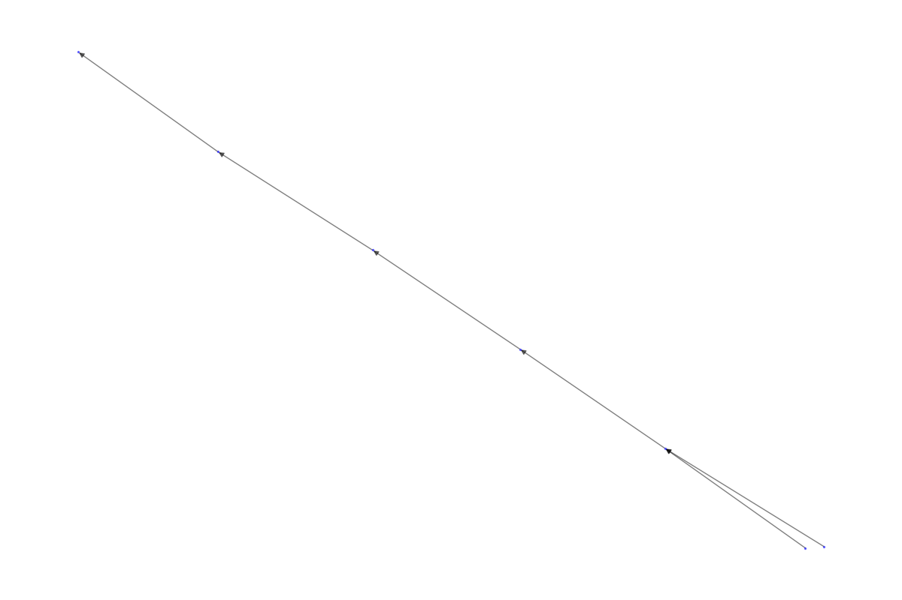
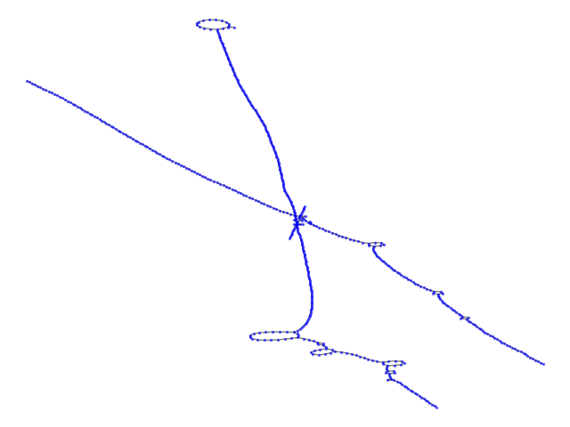
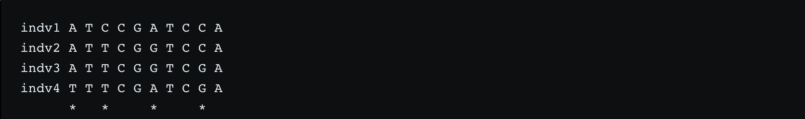
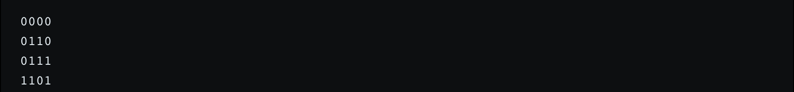
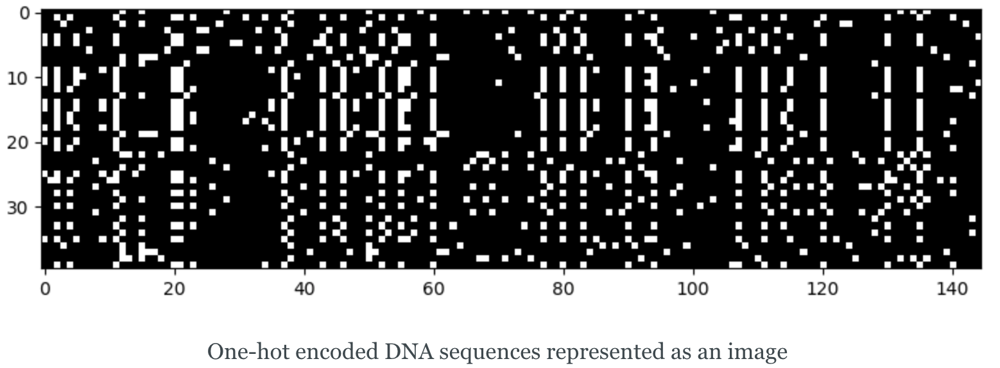
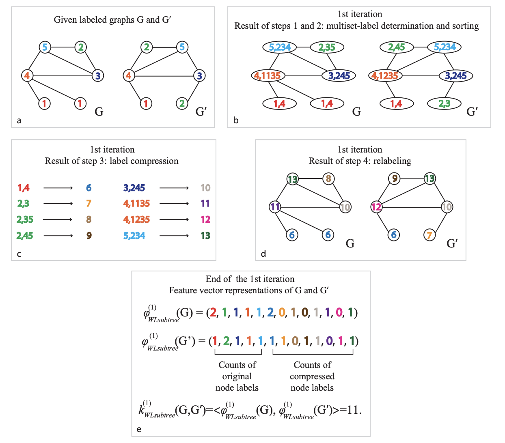
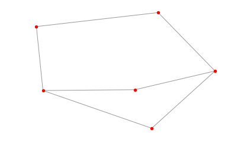
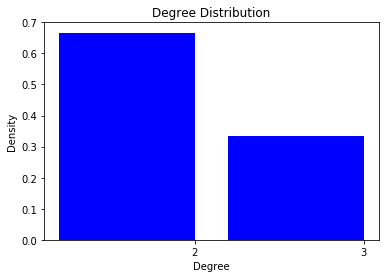
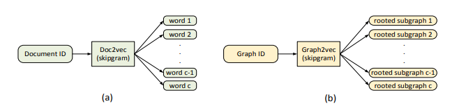
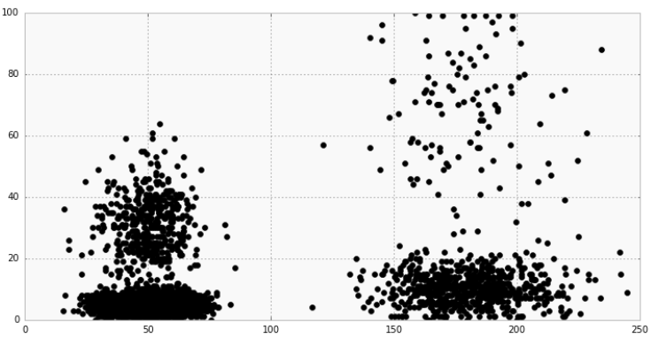

class: inverse, center, middle

# Introduction

```{r setup, include=FALSE}
options(htmltools.dir.version = FALSE)
library(xaringanthemer)
duo(primary_color = "#D8CEC5", secondary_color = "#49475B")
```

---
# Introduction

- What is the problem with Git?

--

- 

---
# Introduction


---
# Introduction

- We want to understand how people use Git
    - What works for workflows
    - What is hindering workflows
    - What are those workflows?
    
--

- There are limitations to how we can approach this
    - We don't have access to local commands
    - We only have commits
        - How do we identify branching and merging?
            - Assumptions!

---

# Introduction

- How do we represent a history of commits?
    - Independent events?
    - Sequences?
--

### Graphs

<p style="text-align:center"> </p>

---
# Introduction

- Git is not any type of graph, it is a Directed Acyclic Graph (DAG)
    - Nodes/Vertices --> Commits
    - Edges --> Connection from one commit to the other
    


Source: [Wikimedia](https://upload.wikimedia.org/wikipedia/commons/c/c6/Topological_Ordering.svg)

---
# Introduction

- We aim to answer two questions:

--

### What are workflow patterns across Git repositories?

--

### What are common sub-patterns in the way people use Git?
    
---
class: inverse, center, middle

# Getting the data

---
# Getting the data

- GitHub API
    - Sampling
    - Rate Limiting
- GitHub Torrent
    - Mines the GitHub API for all latest pushs
    - Tracks all of the repos and makes it available in a MySQL database
    - This means 4TB of overall data
--


---
# Getting the data

- Multiple tables containing information about projects, commits, users, issues, etc.
- Pipeline process:
    - Sample 1 million projects in the DB
    - Get the commits for all the projects
    - Get the parents of the commits for all the projects
    - Save to Buckets for export and storage
- Reproducibility in scope
    - SQL Versioning
    - Data Versioning
    
---
class: inverse, center, middle

# Exploratory Data Analysis

---

# EDA: Simple Repo



---

# EDA: More Complicated Repo




---
class: inverse, center, middle

# Integration

---

class: inverse, center, middle
# Analysis
## What are common sub-patterns in the way people use Git?

---

## Inspiration - genetic data

- comparing to git workflow representation

  - similarity: sequence, i.e. directed
  
  - difference: fixed length, fixed variation (can apply one-hot encoding)

  
  
  

---

## Inspiration - genetic data

- current trend of genetic data study

  - DeepVariant
  
    - converting DNA sequences to images and feeding them through a convolutional neural network
    
    

[Source: https://blog.floydhub.com/exploring-dna-with-deep-learning/]

---

## Inspiration - social network analysis (SNA)

- comparing to git workflow representation

  - similarity: directed
  
  - difference: goal is to predict linkage existence

- can learn from

  - the first step of SNA: learning structural features of connected graph
  
  - using sequence generating algorithms: node2vec

[Source: http://terpconnect.umd.edu/~kpzhang/paper/INFOCOMM2018.pdf]  
---

## Approach - `Node2vec`

- Samples network neighborhoods of each node using the biased random walks
- Based on `Weisfeiler-Lehman Graph Kernels`
  - iterate nodes and edges, relabel and group, represent the features in a vector

  
  
[Source: http://www.jmlr.org/papers/volume12/shervashidze11a/shervashidze11a.pdf]
---

## Approach - `sub2vec`

- learn a feature representation of each subgraph, maximize properties in the latent feature space

- preserve two properties

  - `Neighborhood`: neighborhood information of all the nodes, sets of all paths(annotated by node IDs)
  
  - `Structural`: the overall structure (clique, degree, size of subgraph)

--

- advantage: better accuracy, network embedding methods (Node2vec) preserve various node properties, but lack the properties of entire subgraphs

- disadvantage:  assume unweighted undirected graphs, but can be extended

[Source: https://link.springer.com/chapter/10.1007/978-3-319-93037-4_14]

---

## Approach - Motifs

-  What is a Motif?

  - A subgraph which occurs in a network at a much higher frequency than random chance

  .pull-left[ ]  
  .pull-right[]
  

---
class: inverse, center, middle
# Analysis
## What are workflow patterns across Git repositories?

---

## Graph2Vec Background 

> "[Node2Vec and Sub2Vec] only model local similarity within a confined neighborhood and fails to learn global structural similarities that help to classify similar graphs together"

--

> "a neural embedding framework named graph2vec to learn data-driven distributed representations of arbitrary sized graphs."

--

> "graph2vec's embeddings are learnt in an unsupervised manner and are task agnostic."

---
## Graph2Vec Background



[Source: https://arxiv.org/pdf/1707.05005.pdf]
---

## Clustering Embeddings from Graph2Vec Model



[Source: https://www.datascience.com/blog/k-means-clustering]

---
## Graph2Vec Limitations

> Graph2Vec currently works with undirected graphs, therefore we will have to make modifications to support directed graphs.

--

> Graph2Vec only helps us address the first question (unless we can find a way to extract the learned subgraphs from the neural network).


---

# Projected Timeline

| Milestone  | Date  |   
|---|---|
| Proposal Presentation  | 4/26  |   
| Proposal Report (to mentor)  | 4/30  |
| Proposal Report (to partner)  | 5/3  |
| End-to-end analysis | 5/10 |
| Complete project-level analysis | 5/24 |
| Choose best method for subgraph analysis | 5/31 |
| Choose and demonstrate output from subgraph analysis | 6/7 |
| Complete subgraph analysis | 6/14 |
| Final Presentation | 6/17-18 |
| Final Report (to mentor) | 6/21 |
| Final Report (to partner) and Data Product | 6/26 |

---
class: inverse, middle

# Acknowledgments

- RStudio
    - Greg Wilson
    
- UBC-MDS Teaching Team
    - Tiffany Timbers
    
- UBC-MDS Students