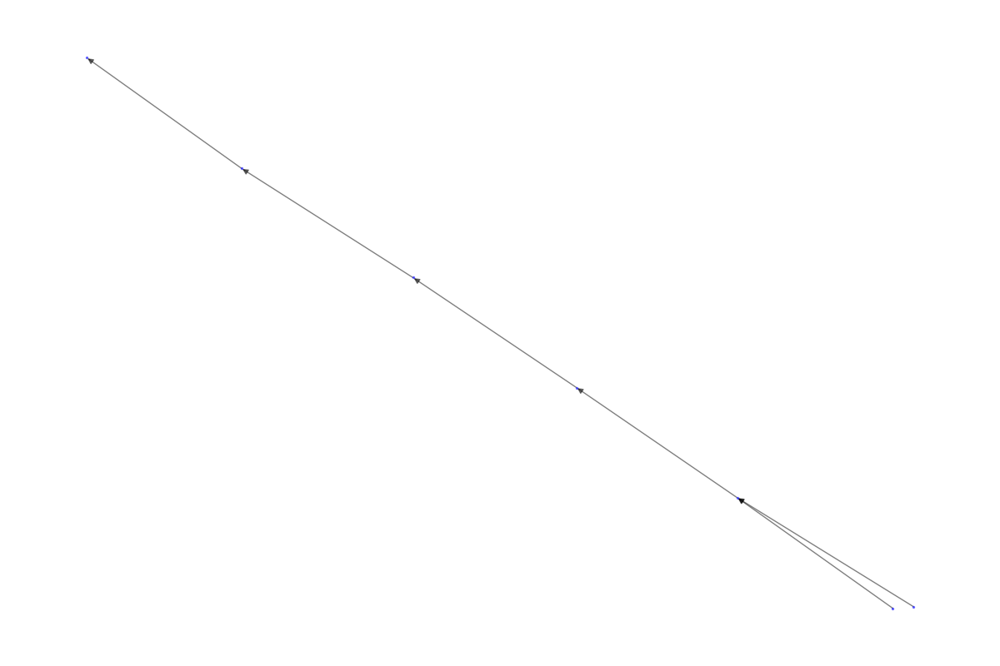
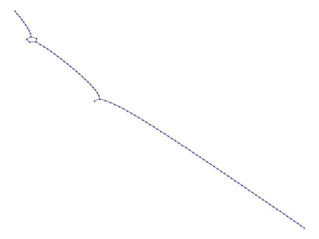
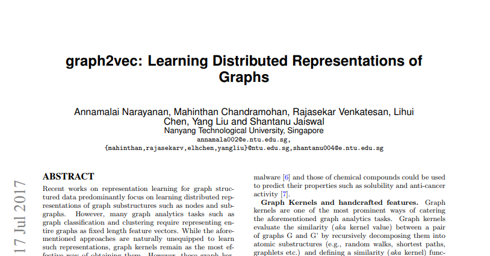
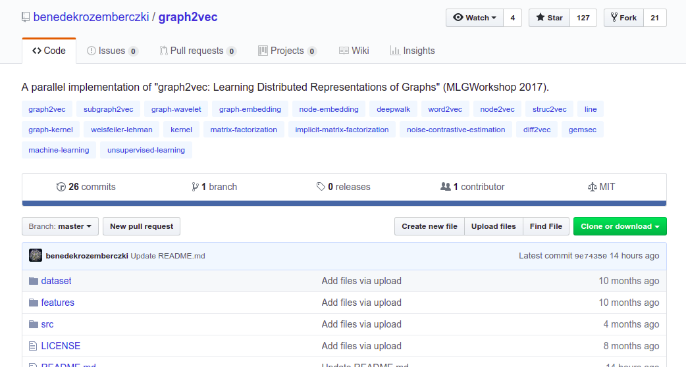
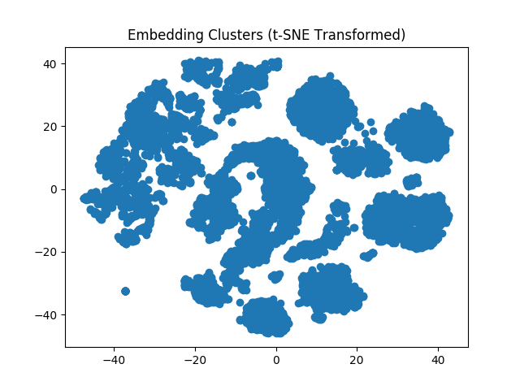
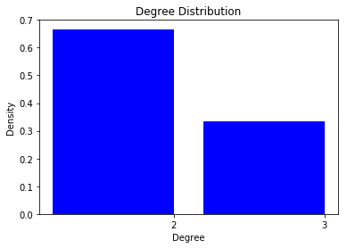
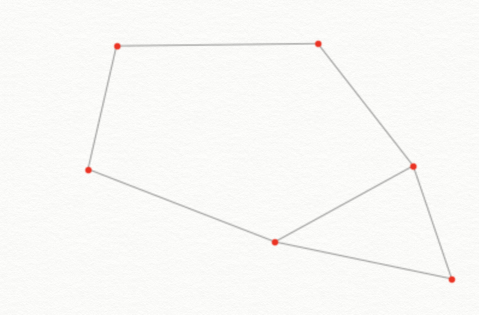
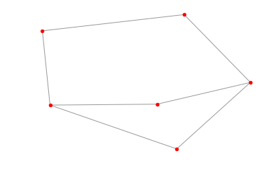

```{r setup, include=FALSE}
options(htmltools.dir.version = FALSE)
library(xaringanthemer)
duo(primary_color = "#D8CEC5", secondary_color = "#49475B")
```

background-image: url(https://git-scm.com/images/logos/downloads/Git-Logo-2Color.png)

???

Image credit: [Git-SCM](https://git-scm.com/images/logos/downloads/Git-Logo-2Color.png)

---
class: center, middle

# What the git is going on here?

---
class: inverse, center, middle

# Introduction

---

- What is the problem with Git?
- Our questions
- Context
- Inverse Pyramid

---
class: inverse, center, middle

# Getting the data

---

- SQL Queries
- Google Cloud Services and BigQuery
- GitHub API and its limitations
- GHTorrent and its benefits and limitations for our project

---
class: inverse, center, middle

# Exploratory Data Analysis

---

# EDA Approach

- Use networkx to turn tabular data into graphs
  - Suggested by partner
- How we're defining nodes and edges
- Advantages
  - Ability to do directed graphs
  - Good for comparing projects and for visualizing subgraphs
  - Force-directed visualization algo 
  - Useful beyond EDA
- Limitations
  - Challenging to visualize the whole dataset
  - Limited customization options
  - Doesn’t have all graph operations (e.g. motifs)

---

# EDA: Simple Repo



---

# EDA: More Complicated Repo




---
class: inverse, center, middle

# Integration

---
class: inverse, center, middle

# Analysis

---
class: inverse, center, middle

---
# Analysis Introduction

- Ultimately trying to “find patterns in the way people actually use git”

- Ideal data to analyze

- Project-to-project comparison

- Finding common subgraphs

---
# Project-level analysis

---

## Graph2Vec Background 



--

> "a neural embedding framework named graph2vec to learn data-driven distributed representations of arbitrary sized graphs."

--

> "graph2vec's embeddings are learnt in an unsupervised manner and are task agnostic."

---

## Graph2Vec Implementation and Limitations



--
> Graph2Vec currently works with undirected graphs, therefore we will have to make modifications to support directed graphs.

--

> Graph2Vec only helps us address the first question (unless we can find a way to extract the learned subgraphs from the neural network).

---
## t-SNE on Graph2Vec Model



---

class: inverse, center, middle

# Subgraph analysis

---

- Approach - sub2vec - Juno
- Approach - genetic data - Juno
- Approach - social network - Juno

---
# Approach - Motifs

-  What’s a Motif?

  - A subgraph which occurs in a network at a much higher frequency than random chance

- Challenges with finding motifs

  - Relies on solving NP-complete problem of subgraph isomorphism

    - Potential Solution: MCMC sampling

  - Haven’t found many resources for identifying motifs

---
Approach - Motifs








---
class: inverse, center, middle

# Projected Timeline