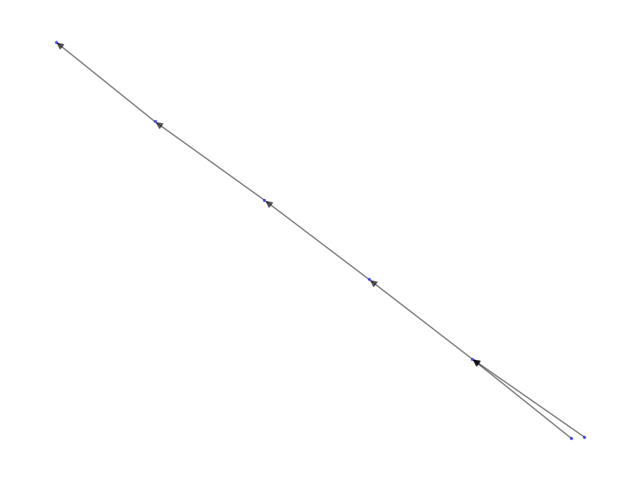
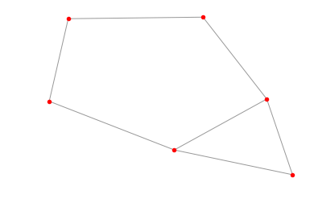

class: inverse, center, middle

# Introduction

```{r setup, include=FALSE}
options(htmltools.dir.version = FALSE)
library(xaringanthemer)
duo(primary_color = "#D8CEC5", secondary_color = "#49475B")
```

---
# Introduction

- What is the problem with Git?

--

- 

---
# Introduction


---
# Introduction

- We want to understand how people use Git
    - What works for workflows
    - What is hindering workflows
    - What are those workflows?
    
--

- There are limitations to how we can approach this
    - We don't have access to local commands
    - We only have commits
        - How do we identify branching and merging?
            - Assumptions!

---

# Introduction

- How do we represent a history of commits?
    - Independent events?
    - Sequences?
--

### Graphs

<p style="text-align:center"> </p>

---
# Introduction

- Git is not any type of graph, it is a Directed Acyclic Graph (DAG)
    - Nodes/Vertices --> Commits
    - Edges --> Connection from one commit to the other
    


Source: [Wikimedia](https://upload.wikimedia.org/wikipedia/commons/c/c6/Topological_Ordering.svg)

---
# Introduction

- We aim to answer two questions:

--

### What are similar projects based on their commit history structure?

--

### What are common sub-patterns in the way people use Git?
    
---
class: inverse, center, middle

# Getting the data

---
# Getting the data

- GitHub API
    - Sampling
    - Rate Limiting
- GitHub Torrent
    - Mines the GitHub API for all latest pushs
    - Tracks all of the repos and makes it available in a MySQL database
    - This means 4TB of overall data
--


---
# Getting the data

- Multiple tables containing information about projects, commits, users, issues, etc.
- Pipeline process:
    - Sample 1 million projects in the DB
    - Get the commits for all the projects
    - Get the parents of the commits for all the projects
    - Save to Buckets for export and storage
- Reproducibility in scope
    - SQL Versioning
    - Data Versioning
    
---
class: inverse, center, middle

# Exploratory Data Analysis

---

# EDA Approach

- Use networkx to turn tabular data into graphs
  - Suggested by partner
- How we're defining nodes and edges
- Advantages
  - Ability to do directed graphs
  - Good for comparing projects and for visualizing subgraphs
  - Force-directed visualization algo 
  - Useful beyond EDA
- Limitations
  - Challenging to visualize the whole dataset
  - Limited customization options
  - Doesn’t have all graph operations (e.g. motifs)

---

# EDA: Simple Repo


---

# EDA: More Complicated Repo




---
class: inverse, center, middle

# Integration

---
class: inverse, center, middle

# Analysis

---
# Analysis Introduction

- Ultimately trying to “find patterns in the way people actually use git”

- Ideal data to analyze

- Project-to-project comparison

- Finding common subgraphs

---
class: inverse, center, middle

# Project-level analysis

---

## Graph2Vec Background 


--

> "a neural embedding framework named graph2vec to learn data-driven distributed representations of arbitrary sized graphs."

--

> "graph2vec's embeddings are learnt in an unsupervised manner and are task agnostic."

---

## Graph2Vec Implementation and Limitations


--
> Graph2Vec currently works with undirected graphs, therefore we will have to make modifications to support directed graphs.

--

> Graph2Vec only helps us address the first question (unless we can find a way to extract the learned subgraphs from the neural network).

---
## t-SNE on Graph2Vec Model


---

class: inverse, center, middle

# Subgraph analysis

---

- Approach - sub2vec - Juno
- Approach - genetic data - Juno
- Approach - social network - Juno

---
# Approach - Motifs

-  What’s a Motif?

  - A subgraph which occurs in a network at a much higher frequency than random chance

- Challenges with finding motifs

  - Relies on solving NP-complete problem of subgraph isomorphism

    - Potential Solution: MCMC sampling

  - Haven’t found many resources for identifying motifs

---
Approach - Motifs





---
class: inverse, center, middle

# Projected Timeline

---
class: inverse, middle

# Acknowledgments

- RStudio
    - Greg Wilson
    
- UBC-MDS Teaching Team
    - Tiffany Timbers
    
- UBC-MDS Students