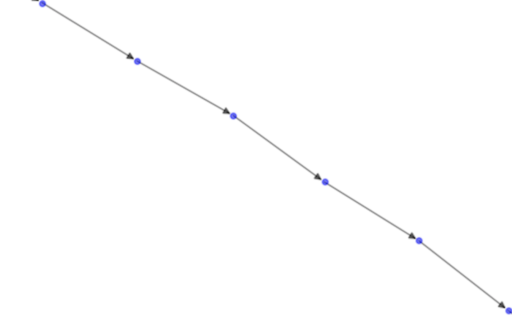
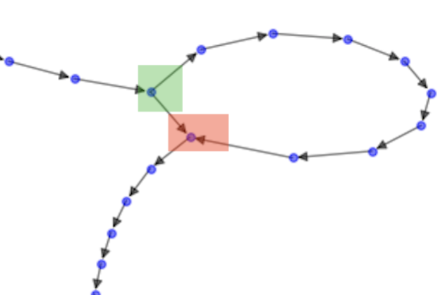
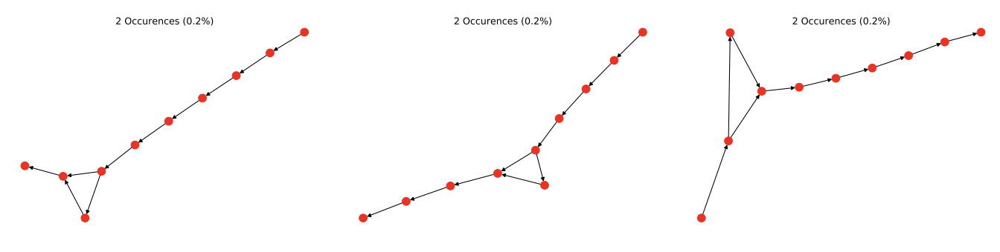
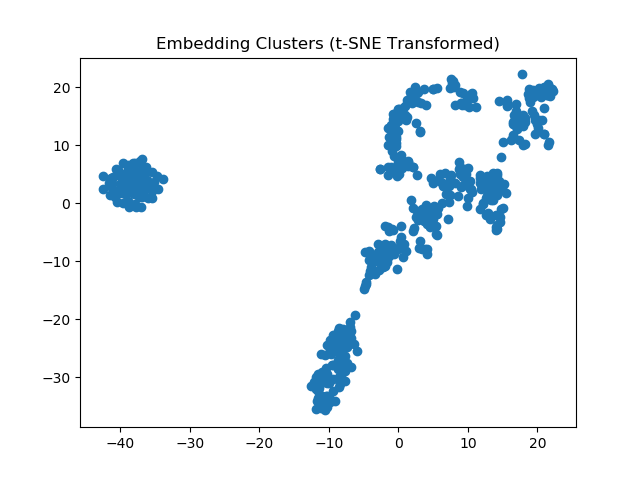

```{r setup, include=FALSE}
knitr::opts_chunk$set(echo = TRUE)
```

## Executive Summary
This project aims to understand how people are currently using GitHub, with the eventual goal of providing recommendations for what features should and should not be included in an easy-to-use alternative to Git. 

We are trying to understand the following questions: *what are the Git workflow patterns that are being used most widely? What are the patterns that, while possible to perform using Git, are not being used widely?* We plan to answer these questions by studying public GitHub repositories and picking out common patterns. Subsequently, we plan to use the solutions we find to recommend what workflow patterns do or do not need to be included into the tool.

## Intro
Git is a Version Control System that was first released in 2005 and has grown to be a popular tool used across multiple domains. In 2018, one of the main Git online repositories, GitHub.com, contains more than 28 million users. Companies like GitHub recommend workflows such as the Git Flow, however we don’t know how many people follow these workflows or others. As well, many users complain that their experiences with Git tend to be troublesome. With this project, we aim to answer two fundamental questions that can enable the development of a new tool that improves and consolidates workflows for users of Version Control Systems. The first question we aim to answer is *What are common subpatterns in the way people use Git?*. With this question we want to see if we can confirm that users follow workflows such as the Git Flow or if they follow other common workflows that are more intuitive for them. The second question we aim to answer is *What are common workflow patterns across Git repositories?*. This question will enable us to understand how different workflows are used in different contexts. By answering this two questions, we will gain insights that will enable the development of a new tool that improves and consolidates workflows for users of Version Control Systems.

## Exploratory Data Analysis
In order to make an easy-to-use alternative to Git, we first need to identify common commit patterns. In order to identify common patterns, we need to be able to generate and then verify hypotheses about what commit patterns are popular among Git users. We can easily generate these hypothesis by visualizing collections of Git commits as graphs using NetworkX, a popular Python package for analyzing and visualizing complex networks.<sup>[1]</sup>. Git commits form a directed acyclic graph<sup>[2]</sup> so we are visualizing them as such. Every commit is a node, and every parent-child relationship between commits is an edge. A node with 2 children occurs when there is a branch, and a node with 2 parents occurs when there is a merge. In the future, we would like to be able to extend our work by taking into account and visualizing the relative time between commits. Time between commits could, for example, be represented by the length of the edges.

{width=300px} {width=300px}

Fig 1: GitHub repo with 6 commits and no branches.	Fig 2: GitHub repo with 17 commits, 1 branch, and 1 

&nbsp;&nbsp;&nbsp;&nbsp;&nbsp;&nbsp;&nbsp;&nbsp;&nbsp;&nbsp;&nbsp;&nbsp;&nbsp;&nbsp;&nbsp;&nbsp;&nbsp;&nbsp;&nbsp;&nbsp;&nbsp;&nbsp;&nbsp;&nbsp;&nbsp;&nbsp;&nbsp;&nbsp;&nbsp;&nbsp;&nbsp;&nbsp;&nbsp;&nbsp;&nbsp;&nbsp;&nbsp;&nbsp;&nbsp;&nbsp;&nbsp;&nbsp;&nbsp;&nbsp;&nbsp;&nbsp;&nbsp;&nbsp;&nbsp;&nbsp;&nbsp;&nbsp;&nbsp;&nbsp;&nbsp;&nbsp;&nbsp;&nbsp;&nbsp;&nbsp;&nbsp;&nbsp;&nbsp;&nbsp;&nbsp;&nbsp;&nbsp;&nbsp;&nbsp;&nbsp;&nbsp;merge(branching pattern in green, merging in red)

## Data Science Techniques

### What are common subpatterns in the way people use Git?
To answer this question, we are ultimately going to produce a table and a bar chart displaying identified subgraphs and their frequencies in the GitHub dataset. A simple approach to accomplish this is to frame this problem as finding common motifs in a network. In network science, motifs are subgraphs which occur in a network at a much higher frequency than random chance<sup>[3]</sup>. We plan to identify motifs by sampling subgraphs and then counting their occurences in the network of Git commits. Then we will attempt to run Sub2Vec on these motif. Sub2Vec is an algorithm that takes in subgraphs and learns the feature representations on both the neighbourhood information and the subgraph structure<sup>[4]</sup>. We plan to apply Sub2Vec to embed the motifs we have found, and then apply clustering algorithms like k-means on the embeddings. Take the below three different motifs all with size of 10 as examples, we expect to cluster them together after applying Sub2Vec as they come with the same size, degree, and branching pattern. We will experiment with different values of the size of subgraphs to achieve optimal class results.



Fig 3: Three different but similar motifs	

### What are common workflow patterns across Git repositories?
For analyzing and comparing features at a project level, we propose Graph2Vec<sup>[5]</sup>: A neural embedding framework to learn data-driven distributed representations of arbitrary sized graphs. We propose Graph2Vec over other subgraph analysis algorithms (such as Sub2Vec<sup>[4]</sup>) due to their lack of ability to model global structure similarities, instead focusing on local similarities within confined neighbourhoods. Using Graph2Vec, we can learn the differences within Git projects in an unsupervised manner and use the generated embeddings to cluster similar graphs together with widely-used clustering algorithms. We can then pick out the most common subpatterns by cluster using the methodology explained in the section above. It may also be possible to use Graph2Vec to also identify common sub-patterns by extract the features its learned.

{width=500px}

Fig 4: Embeddings of sample data on t-SNE	

## Analysis Limitations
Our proposed algorithms assume undirected and unweighted graphs. To apply them to our study, we may need to extend the algorithms to work with directed edges (where we can present the Git workflow) and weighted edges (where we can represent the time elapsed between commits). There are multiple limitations with the data we will use. The data available is only at the commit-level, meaning that we don’t have access to local commands such as ‘git add’, this means that we only have access to a fragment of people’s actual workflow. One other limitation is that we will only be sampling repositories from GitHub, however there are other platforms such as GitLab and BitBucket that also incorporate Git. This only allows us to gain insights from the way people use GitHub, and not VCS in general.

## Expected Timeline

| Milestone | Date |   
|---|---|
| Run first draft of analysis end-to-end (query to common subgraphs outputted) | 5/10 |
| Complete work of associating common Git repositories together and choosing which repos to analyze | 5/24 |
| Be able to demonstrate frequently-occuring classes of subgraphs given a collection of repositories | 6/7 |
| Complete work of finding and displaying most useful frequent classes of subgraphs | 6/14 |
| Final Report (to partner) and Data Product | 6/26 |


## Conclusion

In this project we aim to answer the two main questions *What are common subpatterns in the way people use Git?* and *What are common workflow patterns across Git repositories?*. To answer these questions, we will be using data science techniques such as graph embeddings and clustering. We will evaluate the performance of this techniques by evaluating how well they separate the different workflows and sub-patterns that people use. Techniques that are not performing at the level expected will not be able to distinguish the clusters in a correct manner. With this clusters we will be able to understand common patterns and how people use Git and GitHub to develop recommendations for a new tool that will allow for easier use of Version Control in the way people are using Git today.

## References
[1] Networkx: https://networkx.github.io/documentation/stable/index.html

[2] Git: https://medium.com/girl-writes-code/git-is-a-directed-acyclic-graph-and-what-the-heck-does-that-mean-b6c8dec65059

[3] Motifs: https://link.springer.com/chapter/10.1007/978-3-319-16112-9_2

[4] Sub2vec: https://link.springer.com/chapter/10.1007/978-3-319-93037-4_14

[5] Graph2Vec: https://arxiv.org/abs/1707.05005